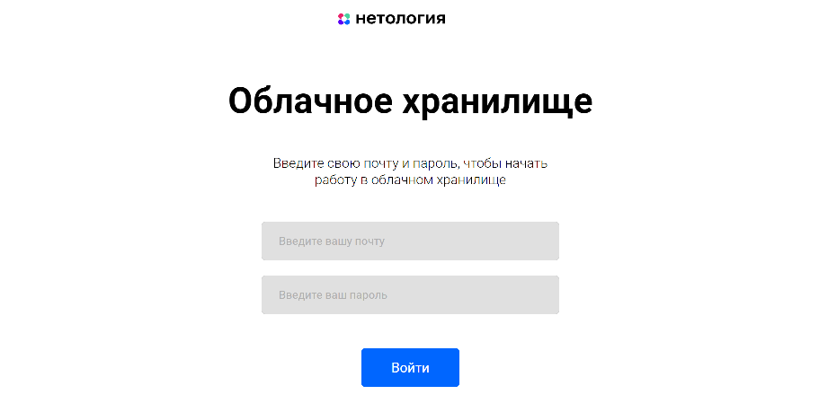
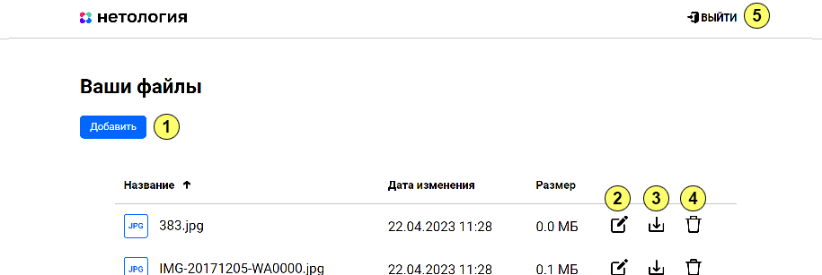

## Описание реализации:

- Приложение разработано с использованием Spring Boot;
- Использован сборщик пакетов Maven;
- Использована база данных MySql;
- Для запуска используется docker;
- Код размещен на github;
- Код покрыт unit тестами с использованием mockito;
- Добавлены интеграционные тесты с использованием testcontainers;
- Информация о пользователях сервиса хранится в базе данных;
- Информация о файлах пользователей сервиса хранится в базе данных.

## ВАЖНО!!!

[Интеграционный тест](src/test/java/ru/netology/IntegrationTestsNetologyCloudApplication.java) и
[JPA тесты](src/test/java/ru/netology/repository) (StorageFileRepositoryTest.java, UserRepositoryTest.java)
изначально закомментированы, поскольку с ними не получится выполнить maven-package, а также собрать docker-контейнер.
После сборки docker-контейнера требуется раскомментировать и запустить данные тесты.

## Запуск приложения

### Запуск FRONT:

1. Скачать [FRONT](https://github.com/netology-code/jd-homeworks/tree/master/diploma/netology-diplom-frontend) (JavaScript) и распаковать его в локальную папку;
2. Установить nodejs 16.17 (с этой версией запускается точно) на компьютер [следуя инструкции](https://nodejs.org/ru/download/);
3. Перейти в папку FRONT приложения и все команды для запуска выполнять из нее;
4. Следуя описанию README.md FRONT проекта запустить nodejs приложение (npm install...);
5. Для запуска FRONT приложения с расширенным логированием использовать команду: `npm run serve`.

### Запуск BACKEND:

1. Скачать данный проект, выполнить `maven -> clean -> package`;
2. Запустить `docker-compose.yml`.
Автоматически создадутся все необходимые в базе данных таблицы (с двумя стартовыми пользователями в таблице users).

### PS:

BACKEND можно запустить и через main метод в классе NetologyCloudStorageApplication.java,
не используя docker-контейнер. Базу данных запускать через docker-контейнер.

Для этого на п.2 "Запуск BACKEND" вместо запуска всего `docker-compose.yml` следует запустить
только `docker-compose.yml -> database`, а само приложение через main метод.
Остальные шаги остаются неизменны.

## Стартовая страница:

Форма авторизации для входа в облачное хранилище.

## Страница облачного хранилища:

После авторизации отобразится список загруженных файлов (изначально пуст).

Веб-интерфейс позволяет:
1. Загружать произвольные файлы (размером до 100 МБайт);
2. Менять имена файлов на случайные имена состоящие из трех цифр;
3. Скачивать файлы;
4. Удалять файлы;
5. Выйти из облачного хранилища на страницу авторизации.

## Стартовые пользователи:

**USERNAME:** user1 **PASSWORD:** user_one

**USERNAME:** user2 **PASSWORD:** user_two
